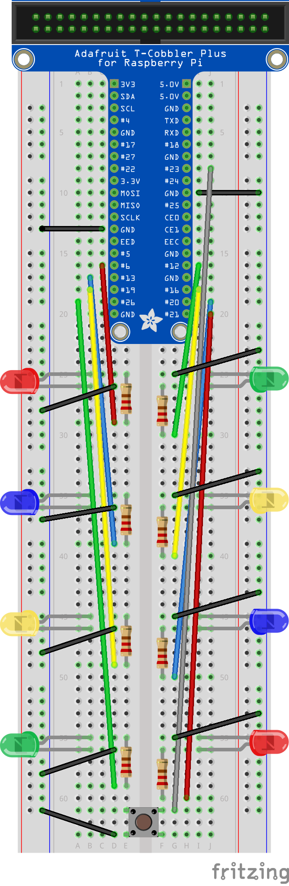

# Christmas lights
Christmas lights for Raspberry Pi.
## Table of contents
* [Technologies](#technologies)
* [Component list](#component-list)
* [Wiring diagram](#wiring-diagram)
* [Installing](#installing)
* [License](#license)
## Technologies
- Python3
- RPi.GPIO library
## Component list
- Raspberry Pi x1
- Breadboard x1
- Jumper wire male to male x18
- LED x8 (red x2, blue x2, yellow x2 and green x2)
- 220Ω (ohms) resistor x8
- Push button x1 (small)
## Wiring diagram

## Installing
## License
